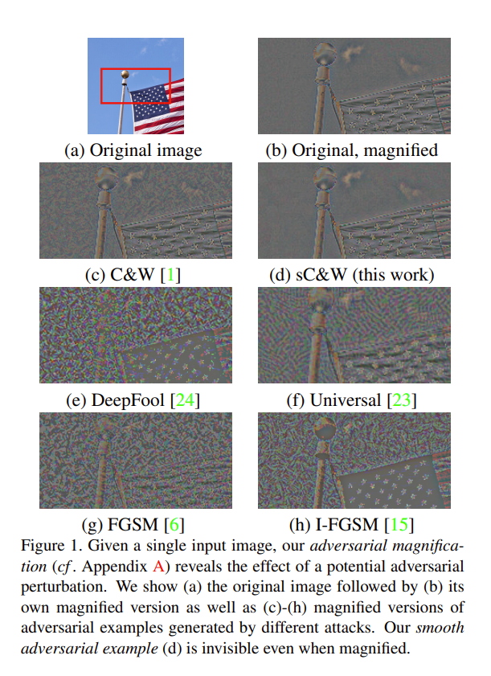

# Smooth Adversarial Examples



This code is for the paper [Smooth Adversarial Examples](https://arxiv.org/pdf/1903.11862.pdf)

## Latest Updates

The original code is built based on the TensorFlow. The attack method are implemented in attacks_SAE.py and attacks_tf_SAE.py

The Laplacian graph is generated by MATALAB codes. These codes are under folder 'matlabGenerate', which show how to generate graphs for the smooth attack.

The codes for magnification are under the folder 'magnify'.

We are trying to translate the MATALAB codes for generating Laplacian graph into python codes, and make the framework more unify. These codes are under folder 'SAE'. It is still under debuging.

## Run the code
1. Install dependencies.
[CleverHans](https://github.com/tensorflow/cleverhans)

2. Run the experiments on ImageNet.
```bash
cd wholeExperiments
python inc_scw.py

-----------------------------------
    Smooth Adversarial Examples
    Copyright (C) 2020 Hanwei Zhang -  Inria Rennes Bretagne Atlantique

    Smooth Adversarial Examples is free software; you can redistribute it and/or modify
    it under the terms of the GNU General Public License as published by
    the Free Software Foundation; either version 2 of the License, or
    (at your option) any later version.

    Smooth Adversarial Examples is distributed in the hope that it will be useful,
    but WITHOUT ANY WARRANTY; without even the implied warranty of
    MERCHANTABILITY or FITNESS FOR A PARTICULAR PURPOSE.  See the
    GNU General Public License for more details.

    To receive a copy of the GNU General Public License, see <http://www.gnu.org/licenses/>.
-------------------------------------
 
